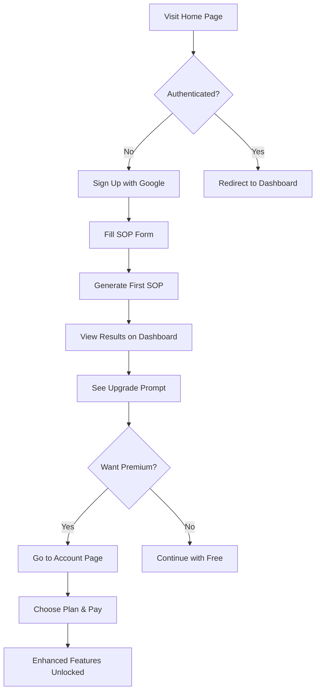
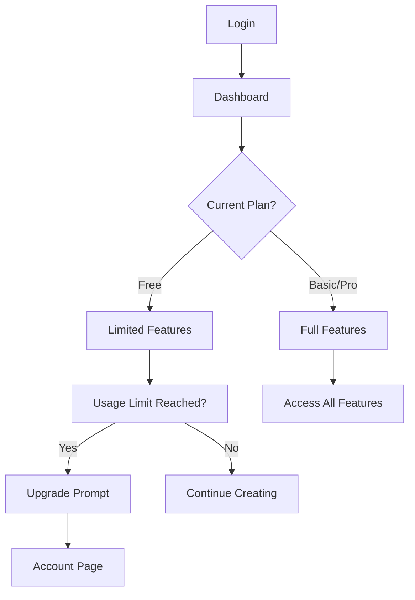

# SOP App Structure & Navigation Workflow

## 🏗 **Page Hierarchy**

```
📱 SOP Application
├── 🏠 Home Page (/)
│   ├── Hero Section
│   ├── Features Overview
│   ├── Pricing Cards (Free, Basic $4.99, Pro $29.99)
│   └── Call-to-Action
│
├── 📊 Dashboard (/dashboard)
│   ├── SOP Display & Editing
│   ├── AI Enhancement Tools
│   ├── Analytics Panel
│   └── Quick Actions
│
├── 👤 Account (/account)
│   ├── Profile Information
│   ├── Subscription Management
│   │   ├── Current Plan Display
│   │   ├── Upgrade/Downgrade Options
│   │   ├── Billing History
│   │   └── Cancel Subscription
│   ├── Usage Statistics
│   └── Logout Button
│
├── 🎯 Analytics (/analytics) [Basic+ Plans]
│   ├── Tone Analysis Results
│   ├── Readability Scores
│   ├── Word Count Optimization
│   ├── Plagiarism Check Results
│   └── Improvement Suggestions
│
└── 💳 Subscription (/subscribe)
    ├── Plan Comparison
    ├── Payment Integration (Stripe)
    ├── Success/Error Pages
    └── Confirmation
```

## 🧭 **Navigation Bar Structure**

```typescript
// Main Navigation Component
interface NavigationItem {
    label: string;
    href: string;
    requiresAuth: boolean;
    minimumPlan?: 'free' | 'basic' | 'pro';
}

const navigationItems: NavigationItem[] = [
    { label: 'Home', href: '/', requiresAuth: false },
    { label: 'Dashboard', href: '/dashboard', requiresAuth: true },
    { label: 'Analytics', href: '/analytics', requiresAuth: true, minimumPlan: 'basic' },
    { label: 'Account', href: '/account', requiresAuth: true }
];
```

## 🔄 **User Journey Workflows**

### **New User Journey**


### **Returning User Journey**


## 📊 **Account Page Layout**

```typescript
// Account page sections
interface AccountSection {
    title: string;
    component: string;
    visibility: 'always' | 'authenticated' | 'subscribed';
}

const accountSections: AccountSection[] = [
    {
        title: 'Profile Information',
        component: 'ProfileCard',
        visibility: 'authenticated'
    },
    {
        title: 'Current Subscription',
        component: 'SubscriptionCard',
        visibility: 'authenticated'
    },
    {
        title: 'Usage Statistics',
        component: 'UsageCard',
        visibility: 'authenticated'
    },
    {
        title: 'Billing & Payment',
        component: 'BillingCard',
        visibility: 'subscribed'
    },
    {
        title: 'Account Settings',
        component: 'SettingsCard',
        visibility: 'authenticated'
    }
];
``` 