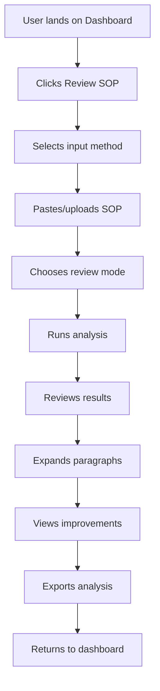

# Phase F: SOP Review & Enhancement System - Test Documentation

## 🎯 **Overview**
Phase F introduces a comprehensive SOP Review & Enhancement System with AI-powered analysis, paragraph-by-paragraph feedback, and intelligent improvement suggestions.

## 🔧 **Components Created**

### 1. **SOPReviewer Component** (`src/lib/components/SOPReviewer.svelte`)
- Multi-input methods (paste, upload, existing SOP)
- Three review modes: Quick, Detailed, University-Specific
- Comprehensive scoring system
- Paragraph-by-paragraph analysis
- Original vs improved text comparison
- Export functionality

### 2. **SOP Review API** (`src/routes/api/review-sop/+server.ts`)
- OpenAI GPT-4 integration with fallback
- Detailed analysis generation
- Database storage for analysis history
- Error handling and validation

### 3. **SOP Review Page** (`src/routes/sop-review/+page.svelte`)
- Dedicated review interface
- Feature highlights and best practices
- Navigation integration

### 4. **Database Schema** (`database_migrations/phase_f_sop_review_system.sql`)
- Analysis storage and tracking
- Review templates for different programs
- User statistics and insights
- Row Level Security (RLS)

## 🧪 **Testing Scenarios**

### **A. SOP Review Component Testing**

#### Test 1: Multiple Input Methods
```bash
# Test copy-paste functionality
1. Navigate to /sop-review
2. Select "Copy & Paste" option
3. Paste sample SOP text (500+ words)
4. Verify word count and paragraph detection
5. Test all three review modes

# Test file upload functionality
1. Select "Upload File" option
2. Upload .txt file with SOP content
3. Verify content is loaded correctly
4. Test error handling for unsupported formats

# Test existing SOP integration
1. Navigate from an existing SOP page
2. Verify pre-populated content
3. Check university and program information
```

#### Test 2: Review Mode Selection
```javascript
// Quick Review Test
{
  "reviewMode": "quick",
  "expectedFeatures": [
    "Overall assessment",
    "Key suggestions",
    "Basic scoring"
  ]
}

// Detailed Analysis Test
{
  "reviewMode": "detailed",
  "expectedFeatures": [
    "Paragraph-by-paragraph breakdown",
    "Comprehensive scoring",
    "Detailed feedback"
  ]
}

// University-Specific Test
{
  "reviewMode": "university_specific",
  "universityName": "Stanford University",
  "programName": "MS Computer Science",
  "expectedFeatures": [
    "Tailored recommendations",
    "Program-specific advice",
    "University alignment analysis"
  ]
}
```

### **B. API Testing**

#### Test 3: SOP Review API
```bash
# Test comprehensive analysis
curl -X POST http://localhost:5175/api/review-sop \
  -H "Content-Type: application/json" \
  -H "Authorization: Bearer YOUR_JWT_TOKEN" \
  -d '{
    "sopText": "As I stand at the threshold of my graduate studies, I am compelled to pursue a Master'\''s degree in Computer Science...",
    "reviewMode": "detailed",
    "universityName": "Stanford University",
    "programName": "MS Computer Science"
  }'

# Expected Response Structure:
{
  "success": true,
  "paragraphAnalyses": [
    {
      "id": 0,
      "originalText": "Full paragraph text...",
      "score": 85,
      "strengths": ["Clear opening", "Strong motivation"],
      "weaknesses": ["Could be more specific"],
      "suggestions": ["Add quantifiable achievements"],
      "improvedText": "Enhanced version...",
      "category": "introduction",
      "importance": "high"
    }
  ],
  "overallAnalysis": {
    "totalScore": 82,
    "wordCount": 650,
    "readabilityScore": 85,
    "coherenceScore": 80,
    "relevanceScore": 88,
    "strengthScore": 86,
    "overallStrengths": ["Clear writing", "Relevant experience"],
    "overallWeaknesses": ["Needs more specificity"],
    "criticalIssues": [],
    "recommendations": ["Add concrete examples"],
    "estimatedImpression": "good"
  }
}
```

#### Test 4: Error Handling
```bash
# Test with missing SOP text
curl -X POST http://localhost:5175/api/review-sop \
  -H "Content-Type: application/json" \
  -d '{"sopText": "", "reviewMode": "detailed"}'

# Expected: 400 error with message "SOP text is required"

# Test without authentication
curl -X POST http://localhost:5175/api/review-sop \
  -H "Content-Type: application/json" \
  -d '{"sopText": "Sample text"}'

# Expected: 401 error with message "Unauthorized"
```

### **C. UI/UX Testing**

#### Test 5: Interactive Features
```javascript
// Test paragraph selection and expansion
1. Complete SOP analysis
2. Click on each paragraph header
3. Verify expansion/collapse behavior
4. Check paragraph scoring and feedback display

// Test improvement toggle
1. Generate analysis with improved versions
2. Click "Show Improvements" button
3. Verify text switches between original and improved
4. Test toggle back to original

// Test export functionality
1. Complete analysis
2. Click "Export Analysis" button
3. Verify JSON file download
4. Validate exported data structure
```

#### Test 6: Responsive Design
```css
/* Test breakpoints */
@media (max-width: 768px) {
  /* Mobile view testing */
  - Feature highlight cards stack vertically
  - Review mode selection responsive
  - Paragraph analysis cards mobile-friendly
  - Action buttons adapt to screen size
}

@media (min-width: 1024px) {
  /* Desktop view testing */
  - Full feature layout
  - Side-by-side comparisons
  - Optimal paragraph analysis display
}
```

### **D. Database Testing**

#### Test 7: Analysis Storage
```sql
-- Verify analysis storage
SELECT 
    id, 
    university_name, 
    program_name, 
    overall_score, 
    word_count,
    review_mode,
    created_at
FROM public.sop_analyses 
WHERE user_id = 'USER_UUID'
ORDER BY created_at DESC;

-- Test analysis history function
SELECT * FROM get_user_analysis_history('USER_UUID');

-- Test analysis statistics
SELECT * FROM get_analysis_statistics('USER_UUID');
```

#### Test 8: Database Functions
```sql
-- Test review templates
SELECT 
    template_name, 
    template_description, 
    criteria, 
    scoring_weights 
FROM public.review_templates 
WHERE is_active = true;

-- Test improvement trends
SELECT * FROM get_improvement_trends();

-- Test materialized view refresh
SELECT refresh_analysis_insights();
SELECT * FROM public.analysis_insights LIMIT 10;
```

### **E. Integration Testing**

#### Test 9: Navigation Integration
```javascript
// Test dashboard integration
1. Navigate to /dashboard
2. Verify "🔍 Review SOP" button presence
3. Click button and verify navigation to /sop-review
4. Test breadcrumb navigation back to dashboard

// Test SOP page integration
1. Navigate to existing SOP (/sop/[id])
2. Verify "🔍 Review SOP" button in actions
3. Click button and verify pre-populated review
4. Verify university and program information transfer
```

#### Test 10: Cross-page State Management
```javascript
// Test URL parameter passing
const testURL = '/sop-review?sop=Sample%20text&university=Stanford&program=CS';
// Verify parameters are parsed and pre-populated correctly

// Test session persistence
1. Start analysis on one session
2. Navigate away and return
3. Verify analysis state is maintained (if implemented)
```

## 📊 **Performance Testing**

### Test 11: Analysis Performance
```bash
# Test analysis speed with different content sizes
echo "Testing 500-word SOP..." | time curl -X POST ...
echo "Testing 1000-word SOP..." | time curl -X POST ...
echo "Testing 1500-word SOP..." | time curl -X POST ...

# Expected performance:
# - 500 words: < 10 seconds
# - 1000 words: < 15 seconds  
# - 1500 words: < 20 seconds
```

### Test 12: Concurrent Users
```bash
# Simulate multiple simultaneous analyses
for i in {1..5}; do
  curl -X POST http://localhost:5175/api/review-sop \
    -H "Content-Type: application/json" \
    -d "$(cat test_sop_${i}.json)" &
done
wait

# Monitor response times and success rates
```

## 🔒 **Security Testing**

### Test 13: Authentication & Authorization
```bash
# Test unauthorized access
curl -X GET http://localhost:5175/sop-review
# Should redirect to login if not authenticated

# Test RLS policies
# Attempt to access another user's analysis
# Should return empty result or access denied
```

### Test 14: Input Validation
```javascript
// Test XSS prevention
const maliciousInput = '<script>alert("xss")</script>';
// Submit as SOP text and verify sanitization

// Test SQL injection attempts
const sqlInput = "'; DROP TABLE sop_analyses; --";
// Verify input is safely handled

// Test large input sizes
const largeInput = 'A'.repeat(50000);
// Verify appropriate handling and limits
```

## 🚀 **User Acceptance Testing**

### Test 15: End-to-End User Journey


### Test 16: Feature Completeness Checklist
- [ ] Multiple input methods working
- [ ] All three review modes functional
- [ ] Comprehensive scoring system
- [ ] Paragraph-by-paragraph analysis
- [ ] Improvement suggestions generated
- [ ] Original vs improved text toggle
- [ ] Export functionality working
- [ ] Navigation integration complete
- [ ] Database storage operational
- [ ] Error handling robust
- [ ] Mobile responsiveness verified
- [ ] Performance acceptable
- [ ] Security measures in place

## 📈 **Analytics & Monitoring**

### Test 17: Usage Analytics
```sql
-- Monitor analysis completion rates
SELECT 
    DATE(created_at) as analysis_date,
    COUNT(*) as total_analyses,
    AVG(overall_score) as avg_score,
    review_mode,
    COUNT(DISTINCT user_id) as unique_users
FROM public.sop_analyses 
WHERE created_at >= NOW() - INTERVAL '7 days'
GROUP BY DATE(created_at), review_mode
ORDER BY analysis_date DESC;

-- Track improvement trends
SELECT 
    category,
    AVG(paragraph_score) as avg_score,
    COUNT(*) as frequency
FROM public.analysis_feedback af
JOIN public.sop_analyses sa ON af.analysis_id = sa.id
WHERE sa.created_at >= NOW() - INTERVAL '30 days'
GROUP BY category
ORDER BY frequency DESC;
```

## 🐛 **Bug Testing Scenarios**

### Test 18: Edge Cases
```javascript
// Empty SOP content
testInput = "";

// Very short SOP (< 100 words)
testInput = "I want to study computer science because I like computers.";

// Very long SOP (> 2000 words)
testInput = "A".repeat(2001);

// Special characters and formatting
testInput = "SOP with émojis 🎓 and spéciål chäractërs";

// Non-English content
testInput = "这是一个中文的个人陈述...";

// Mixed content (English + other languages)
testInput = "My motivation stems from my passion for technology. En français, je dirais...";
```

### Test 19: Browser Compatibility
```bash
# Test on different browsers
- Chrome (latest)
- Firefox (latest)  
- Safari (latest)
- Edge (latest)
- Mobile Chrome
- Mobile Safari

# Verify:
- Text input/paste functionality
- File upload works
- Analysis results display correctly
- Export functionality works
- Navigation functions properly
```

## 📋 **Production Readiness Checklist**

### Final Deployment Tests
- [ ] Environment variables configured (OPENAI_API_KEY)
- [ ] Database migrations applied successfully
- [ ] API endpoints responding correctly
- [ ] Authentication flow working
- [ ] Error logging implemented
- [ ] Performance monitoring active
- [ ] Backup procedures tested
- [ ] SSL certificates valid
- [ ] CDN configuration optimal
- [ ] Rate limiting configured
- [ ] Documentation complete

## 🎉 **Success Criteria**

Phase F is considered complete when:

1. **Functionality**: All core features working as designed
2. **Performance**: Analysis completes within acceptable timeframes
3. **Reliability**: Error rate < 1% for valid inputs
4. **Usability**: Users can complete analysis workflow without assistance
5. **Security**: All security tests pass
6. **Integration**: Seamless integration with existing application
7. **Scalability**: Can handle expected user load
8. **Maintainability**: Code is well-documented and testable

## 📞 **Support & Troubleshooting**

### Common Issues & Solutions

1. **Analysis fails to complete**
   - Check OpenAI API key configuration
   - Verify network connectivity
   - Review input text length and content

2. **Database errors**
   - Confirm migrations applied
   - Check RLS policies
   - Verify user permissions

3. **UI not responsive**
   - Clear browser cache
   - Check console for JavaScript errors
   - Verify CSS loading correctly

4. **Export not working**
   - Check browser download settings
   - Verify popup blockers disabled
   - Test file creation process

---

**Phase F: SOP Review & Enhancement System** provides comprehensive AI-powered analysis capabilities that significantly enhance the user experience and add substantial value to the SOP generation platform. The system is designed for scalability, reliability, and ease of use while maintaining high security standards.